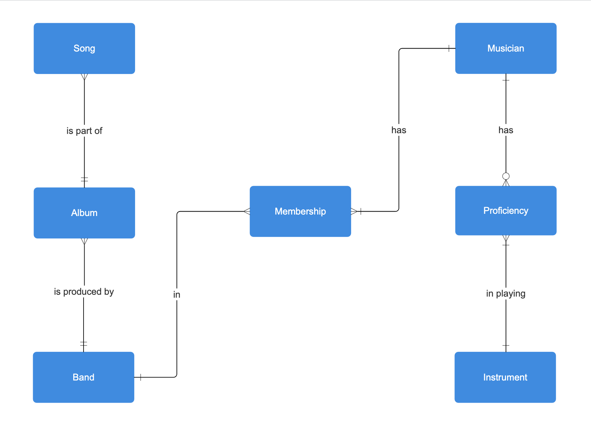

# Design Document

By Thomas Mullen

Video overview: https://www.youtube.com/watch?v=hoeiUS9YI_c

## Scope

The purpose of this CS50 SQL database submission is to keep a record of relationships between songs, albums, the bands that produced them, the individual members of each band and a list of musical intruments. This information is kept in a virtual 'jukebox' database. Included in the scope of this database is:

* Individual songs, including some information about each song and which album it is a part of
* Individual albums, including information about the album as well as which band it was produced by
* Bands, including data such as the year formed and whether they are still active
* Musicians, which includes information about individual musical artists
* Instruments, containing a small amount of information about different types of instruments

Some elements not in the scope of this database are pieces of information regarding locations where musicians were born or performed, and any data relating to sales or tours.

## Functional Requirements

This database will allow users to:

* Add new songs/albums for bands, including those that are still active and producing music
* Keep track of musicians who are members in more than one band
* Add multiple instruments for a single musician

This database will not support adding songs to more than one album at a time. The database only includes studio albums and not live/compliation albums.

## Representation

SQLite tables are created with the following schema to record the data.

### Entities

The jukebox database includes the following entities:

#### Songs

The `songs` table has the following attributes:

* `id`: This is an `INTEGER` which represents a unique song in the table. It is therefore specified as a `PRIMARY KEY`.
* `album_id`, which is an `INTEGER` representing the ID of the album that the song belongs to. This column references the `id` column in the `albums` table, therefore it has the `FOREIGN KEY` constraint.
* `song_title`, which is the title of the song. This column uses the `TEXT` data type due to this being the most appropriate variable type for a title.
* `duration_in_seconds`, which is the length of the song in seconds represented as an `INTEGER`. `INTEGER` was used as the duration in seconds is always a whole number.

All columns in this table require some data, and cannot be NULL. Therefore, the `NOT NULL` constraint is added for columns that are not specified as a `PRIMARY KEY` or `FOREIGN KEY`. The `duration_in_seconds` column has a constraint to check that the value inputted is greater than or equal to 0, as a song cannot have a negative duration.

#### Albums

The `albums` table has the following attributes:

* `id`: This is a an `INTEGER` which represents a unique album in the table. It is therefore specified as a `PRIMARY KEY`.
* `band_id`, which is an `INTEGER` representing the ID of the band that produced each album. This column references the `id` column in the `bands` table, therefore it has the `FOREIGN KEY` constraint.
* `album_title`, which is the title of the album. This field uses `TEXT` due to this being the most appropriate variable type for a title.
* `duration_in_seconds`, which is the length of the album in seconds represented as an `INTEGER`. `INTEGER` was used as the duration in seconds is always a whole number.
* `release_date`, which is the original date that the album was released on. This is of type `TEXT` which can be used to store date strings in the format `YYYY-MM-DD`.

All columns in this table require some data, and cannot be NULL. Therefore, the `NOT NULL` constraint is added for columns that are not specified as a `PRIMARY KEY` or `FOREIGN KEY`. The `duration_in_seconds` column has a constraint to check that the value inputted is greater than or equal to 0, as an album cannot have a negative duration.

#### Bands

The `bands` table has the following attributes:

* `id`: This is an `INTEGER` which represents a unique band in the table. It is therefore specified as a `PRIMARY KEY`.
* `band_name`, which is the name of the band. This field uses `TEXT` due to this being the most appropriate variable type for a name.
* `year_formed`, which is the year that the band formed. Since this number will always be a whole value (eg. 1975), `INTEGER` is used.
* `number_of_albums`, which is an `INTEGER` representing the number of albums that the band has released.
* `is_active`, which is a `BOOLEAN` representing whether or not the band is still active in this current year (from January 1st 2024 onwards).

All columns in this table require some data, and cannot be NULL. Therefore, the `NOT NULL` constraint is added for columns that are not specified as a `PRIMARY KEY` or `FOREIGN KEY`. The `number_of_albums` column has a constraint to check that the value inputted is greater than or equal to 0, as a band cannot have a negative number of albums.

#### Musicians

The `musicians` table has the following attributes:

* `id`: This is an `INTEGER` which represents a unique musical artist in the table. It is therefore specified as a `PRIMARY KEY`.
* `first_name`, which is the first name of the musician. This field uses `TEXT` due to this being the most appropriate variable type for a name.
* `last_name`, which is the last name of the musician. This field uses `TEXT` due to this being the most appropriate variable type for a name.
* `date_of_birth`, which is the date that the musician was born. This is of type `TEXT` which can be used to store date strings in the format `YYYY-MM-DD`.
* `is_active`, which is a `BOOLEAN` representing whether or not the musician is still active in this current year (from January 1st 2024 onwards).

All columns in this table require some data, and cannot be NULL. Therefore, the `NOT NULL` constraint is added for columns that are not specified as a `PRIMARY KEY` or `FOREIGN KEY`.

#### Instruments

The `instruments` table has the following attributes:

* `id`: This is an `INTEGER` which represents a unique musical instrument in the table. It is therefore specified as a `PRIMARY KEY`.
* `instrument_name`, which is the name of the instrument. This field uses `TEXT` due to this being the most appropriate variable type for a name.
* `instrument_type`, which is the type of the instrument. This field uses `TEXT` due to this being the most appropriate variable type for a descriptive type.

All columns in this table require some data, and cannot be NULL. Therefore, the `NOT NULL` constraint is added for columns that are not specified as a `PRIMARY KEY` or `FOREIGN KEY`.

There were also two junction tables connected for entities with many-to-many relationships. These are:

#### Memberships

The `memberships` table represents a many-to-many relationship between bands and musicians. This table has the following attributes:

* `id`: This is an `INTEGER` which represents a unique connection between a band and a musician in the table. It is therefore specified as a `PRIMARY KEY`.
* `band_id`, which is the ID of the band that is a part of the specified connection. This column references the `id` column in the `bands` table, therefore it has the `FOREIGN KEY` constraint.
* `musician_id`, which is the ID of the musician that is a part of the specified connection. This column references the `id` column in the `musicians` table, therefore it has the `FOREIGN KEY` constraint.

As all columns in this table are either a primary key or a foreign key, there is no need to specify `NOT NULL` for any of the attributes.

#### Proficiencies

The `proficiencies` table represents a many-to-many relationship between musicians and instruments. This table has the following attributes:

* `id`: This is an `INTEGER` which represents a unique connection between a musician and an instrument in the table. It is therefore specified as a `PRIMARY KEY`.
* `musician_id`, which is the ID of the musician that is a part of the specified connection. This column references the `id` column in the `musicians` table, therefore it has the `FOREIGN KEY` constraint.
* `instrument_id`, which is the ID of the instrument that is a part of the specified connection. This column references the `id` column in the `instruments` table, therefore it has the `FOREIGN KEY` constraint.

As all columns in this table are either a primary key or a foreign key, there is no need to specify `NOT NULL` for any of the attributes.

### Relationships

The below entity relationship diagram describes the relationships among the entities in the database.

The following concepts are represented by the connections in the diagram:

* One song can only be part of one album, but an album can contain many songs. This database does not account for compilation albums or rereleases so assumes that each song is only part of a single album.
* One album can only be associated with one band, and a band can produce many albums.
* A band can have many musician members, and each musician could be part of one or multiple bands. A junction table of memberships was created to represent this many-to-many relationship.
* A musician can play several instruments, or zero (if they are just a singer), and each instrument is played by one or many different musicians. A junction table of proficiencies was created to represent this many-to-many relationship.

## Optimizations

In my database, I created two views, band_discography and band_members. band_discography allows for a user to see the songs, albums and bands tables combined without having to input a large query themselves. This view allows them to easily view which songs were published by which band, as well as information pertaining to album/song lengths and release dates. band_members uses the memberships table to join the bands and musicians tables together, and then takes the result of this and connects it with the instruments table, using the proficiencies table. This view is a shortcut for a long and complex query, and allows the user to view all of the members of a particular band, as well as information pertaining to the instrument(s) that each band member plays.

Users will often use the database to search for which bands a musician is in, as well as which musicians are members of a particular band. Indexes were created on the `first_name` and `last_name` column of the `musicians` table, to make identifying all the bands containing that musician a more efficient process. An index was also created on the `band_name` coloumn of `bands` to make this respective search process faster. Indexes were also created to speed up the processes of looking up the number of albums a band has released, and looking up song names.

## Limitations

The current version of the schema assumes that songs can only be found on a single album, and does not account for songs that are not found on any album. The database could be updated to include a many-to-many relationship between songs and albums, to account for compilation albums and rereleases. The schema also assumes that a band contains 2 or more musicians, and that each album was only produced by one band, so does not account for a many-to-many relationship between albums and bands (e.g. an album that was produced as a collaborative effort between 2 or more bands).